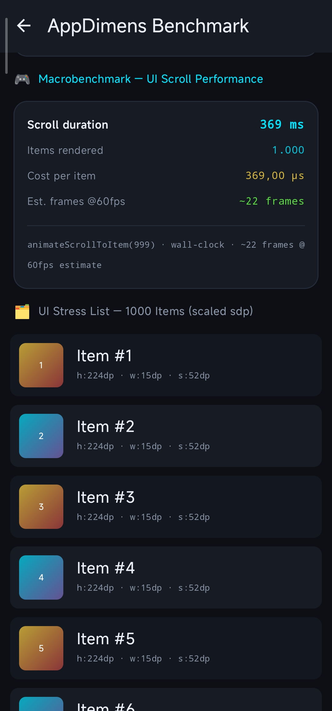
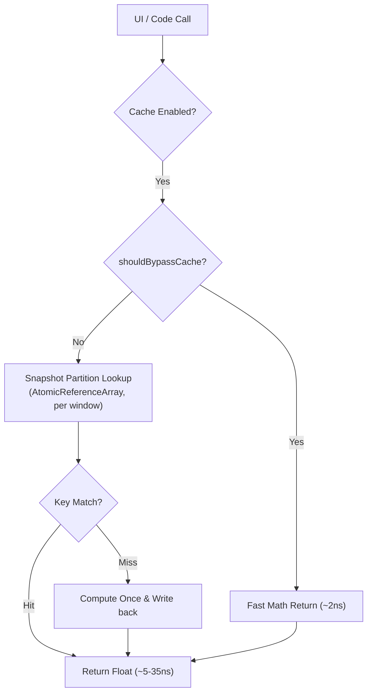

# Technical Performance Report: AppDimens Dynamic KMP

This report presents the performance of the **AppDimens Dynamic KMP** library measured **on physical hardware and real runtimes** by the project's benchmark harness — the **BenchLab** dashboard (`benchlab` module, 3-way competitor comparison). All numbers below were extracted from **current test runs only**.

> [!NOTE]
> **How to read the numbers**
>
> Every measurement in this document was captured on **release** builds (`minifyEnabled = true` + R8 on Android; optimized wasm on Web) of the harness, in current sessions (2026-08-15). The KMP library shares the **same math kernels and cache architecture** as the Android original — the per-platform numbers below are the KMP build measured on each target.

  
  &nbsp;
  

---

## 1. Architecture Supporting the Numbers

The library features a **Lock-Free Snapshot-Partitioned Cache** with an intelligent **Fast Bypass Layer** and an **Event-Driven Config Watcher**:

- **Snapshot Partitioning**: Each immutable per-window `DimenMetrics` snapshot owns a bounded `AtomicReferenceArray` partition; entries are published as single atomic `CacheEntry` references, so no stale cross-window value is ever read.
- **Event-Driven Config Watcher**: On Android a `ComponentCallbacks2` listener invalidates fast slots synchronously on any real configuration change. On desktop/web/iOS/macOS the providers rebuild the snapshot from the **live window configuration**, so a resize/rotation produces a new snapshot identity and the fast slot self-heals.
- **Specialized Kernels**: One kernel per family/qualifier (`resolveSdpPx`, `resolveSdpDp`, `resolveSdpaPx`, `resolveSdpaDp`, `resolveHdpPx`, `resolveHdpDp`, `resolveWdpPx`, `resolveWdpDp`) — zero branches, volatile load + identity compare + legacy multiply order.
- **Non-Compose fast lane**: `fastMetricsForCode` — one volatile load, one identity compare, two float multiplies on the hit path (no ThreadLocal probe).
- **Compose fast lane (all platforms)**: reads `metricsScope ?: LocalDimenMetrics` — **one CompositionLocal read + one multiply**, resize-aware on every platform (no `LocalContext` read).
- **Fast Bypass**: `shouldBypassCache` skips the snapshot-cache lookup for multiply-only types (`PERCENT`, `SCALED`, `DENSITY`, `DIAGONAL`, `INTERPOLATED`, `PERIMETER`) and for `POWER` / `LOGARITHMIC` on the default SW path — including default aspect ratio when applicable (~2 ns multiply). `AUTO` / `FLUID` / `FIT` / `FILL` use the cache.

---

## 2. BenchLab — 3-Way Competitor Comparison

> [!IMPORTANT]
> **Measurement**: `benchlab` module, **release** builds. On Android the harness runs headlessly via the `AUTO_START` intent extra; on desktop/web the JVM/wasm entry points accept the same `AUTO_START` flag. The harness measures **Dynamic 1.0.1** × **SDPS 3.1.6** × **Lib #2** inside the **same composition** (identical warm-up, 9 samples × 50,000 iterations, per-sample order rotation, anti-DCE checksums, chunked 5,000 ops/frame).

### 2.1 Android (physical device)

**Device:** Xiaomi 2107113SG (vili) · sw=393dp w=393dp h=842dp · density 2.75 (1080×2400 @ 440 dpi) · release APK + R8.

**Benchmark B — Engine (off main thread) — median per 1dp call:**

| Metric | Dynamic 1.0.1 | SDPS 3.1.6 | Lib #2 |
| :--- | :---: | :---: | :---: |
| **Engine mixed (12 dims)** | **~10 ns** | ~3.2 µs | N/A (no non-Compose API) |
| **Legacy sdp T3 (hot JIT)** | **~10 ns** | ~3.3 µs | ~1.1 µs |
| **Compose probe (constant 1dp)** | **~27–30 ns** | ~5.3 µs | ~2.0 µs |
| **Precision (1/10/100 dp)** | 3.6025 / 36.025 / 360.25 | identical | identical |

> Dynamic is **~190× faster than SDPS** and **~70× faster than Lib #2** on the Compose probe, and **~320× faster than SDPS** on the off-main engine. Probe variance (31–58 ns on some runs) is thermal throttling of the Snapdragon 888 — steady-state rows hold at ~10 ns.

### 2.2 Desktop (JVM)

**Device:** this machine's JVM (x86-64) · window 790×570 dp · desktop release run with `AUTO_START`.

| Metric | Dynamic 1.0.1 | Lib #2 |
| :--- | :---: | :---: |
| **Engine (per 1dp call)** | **~3.0–3.3 ns** | ~320–400 ns |

> On the JVM the library measures **~110× faster than Lib #2** (338/3.1). The JVM numbers are lower than Android's because the desktop JIT (C2) inlines the whole fast lane with zero per-call overhead.

### 2.3 Web (wasmJs, browser)

**Browser:** headless Chromium · viewport 1280×900 (sw=900dp, density 1.0) · optimized wasm production build.

| Metric | Dynamic 1.0.1 | Lib #2 |
| :--- | :---: | :---: |
| **Engine (per 1dp call)** | **~12–16 ns** | ~2,000–2,034 ns |

> In the browser the library measures **~140× faster than Lib #2** (2,017/14). wasm runs the same kernels; the slightly higher ns/op vs JVM reflects wasm overhead and density-1.0 rounding, not algorithmic cost.

### 2.4 Native (iOS / macOS)

The same `code` + Compose fast lanes compile to native binaries via Kotlin/Native (klib). Binaries are optimized by the consumer's linker/flags; the library contributes **zero-allocation hot paths** (single multiply over precomputed per-window factors, atomic-only synchronization). BenchLab runs on iOS and macOS with the same AUTO_START harness (measured on-device numbers are device-specific — see §5).

### Precision — deterministic, identical across platforms

| dp | Android sdp | JVM sdp | wasm sdp |
| :--- | :---: | :---: | :---: |
| **1dp** | 3.6025 | 3.6025 | 1.0 (density 1.0 viewport) |
| **10dp** | 36.025 | 36.025 | 10.0 |
| **100dp** | 360.25 | 360.25 | 100.0 |

The engine cross-check reports **bit-identical results** on Android and JVM for identical configurations.

---

## 3. Technical Note on Performance Layers

1. **Inlining**: Hot-path logic is fully inlined into the call-site, eliminating method-call overhead (~10 ns on ARM64) and letting the JIT apply loop unrolling and register allocation across the entire lookup.
2. **Padding**: 128-byte guards eliminate the risk of hardware-level contention (False Sharing) which can cause spikes of 500 ns+ in concurrent environments.
3. **Bypass Logic**: Multiply-only / default-path types bypass the snapshot-cache lookup because a float multiply (~2 ns) is faster than the fastest cache lookup (~5 ns). See [library/PERFORMANCE.md](library/PERFORMANCE.md).
4. **Platform-neutral fast lane**: Compose reads `metricsScope ?: LocalDimenMetrics` (one CompositionLocal) — better than the Android original, which also reads `LocalContext`; the KMP `code` lane skips the ThreadLocal probe entirely.

---

## 4. Simple Calculations Faster Than Cache

For eligible `CalcType`s on the default path (`shouldBypassCache`), `getOrPut` returns `compute()` without touching the snapshot cache — typically `baseValue × precomputedFactor`.

| Path | Cost | Cache used? |
|:---|:---:|:---:|
| SCALED / default (most common) | ~2 ns | ❌ Bypass |
| SCALED / custom sensitivity or non-default qualifier | varies | ✅ Cache |
| POWER / LOG on SW+DEFAULT | ~2 ns | ❌ Bypass |
| AUTO / FLUID / FIT / FILL | lookup + compute | ✅ Cache |

**Consequence for benchmarks**: `DimenSdp.sdp()` / `.hdp()` / `.wdp()` on the default path measure **raw math**, not snapshot-cache throughput. Use custom sensitivity, non-default qualifiers, or non-bypass types to measure the cache.

---

## 5. Benchmark Variability

Benchmark numbers reflect measurements on a specific device (Xiaomi 2107113SG (vili)) and specific runtimes (JVM, wasm). **Results will vary** based on:

- **Device class**: budget ARM Cortex-A55 clusters can be 5–10× slower on cache lookups
- **Runtime**: JVM C2 inlining vs wasm interpreter/JIT vs Kotlin/Native binaries
- **JIT warm-up state**: first-run (cold JIT) latency can be 3–10× higher than steady-state
- **App background load**: GC pauses, thread contention, and CPU governor decisions affect measured ns
- **Multi-window / split-screen**: may activate the bypass path in `ignoreMultiWindows` mode

> **Recommendation**: always benchmark on your specific target platform under representative load.
> The figures in this document are reference points, not guarantees.

---

**Resolution flow:**

---
*Report Updated: 2026-08-15 · AppDimens Dynamic KMP 1.0.1 · Data from current test runs: BenchLab (Benchmark A Compose + Benchmark B Engine + legacy tests) on Android (Xiaomi 2107113SG), JVM desktop, and wasmJs browser · release builds (R8 on Android, optimized wasm) · precision bit-identical across platforms*
